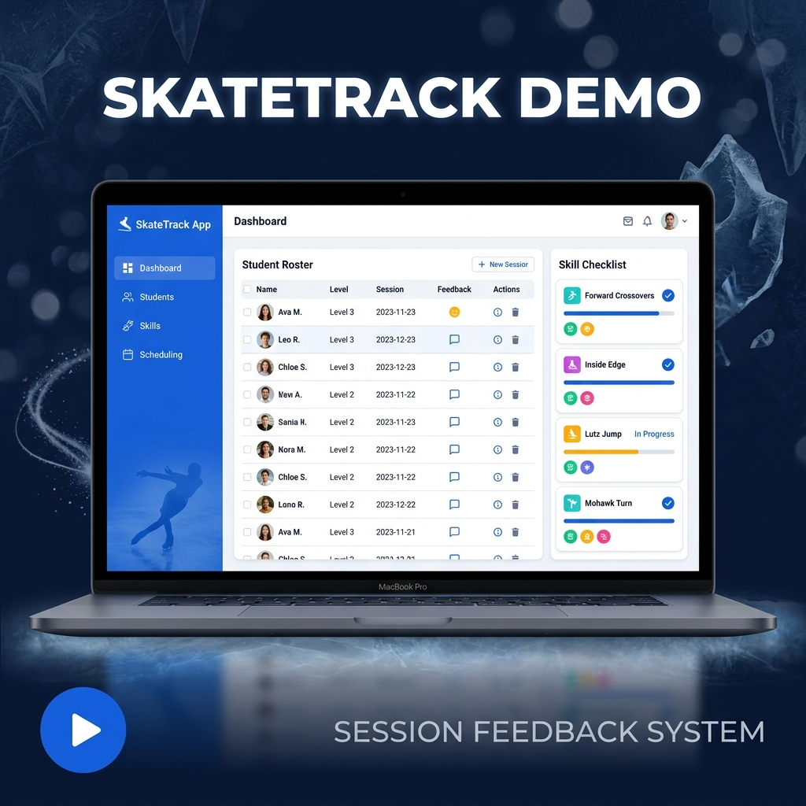

# SkateTrack — Session Feedback System

A session feedback app for ice skating schools. Instructors log in, complete skill checklists for their students, and submit reports. Admins review and print the submitted evaluations.

> Developed in the class **I400-Vibe and AI Programming, Spring 2026, IUB**, with the assistance of models (Gemini, Claude) within (Google Antigravity).

---

## Demo Video

[](docs/demo.mp4)

---

## Features

### Instructor Workflow
- Log in with role-based redirect (instructors land on `/instructor`)
- View assigned classes on a dashboard
- Open a class roster with evaluation status badges
- Select a student and complete a level-based skill checklist (Pass / Not Yet toggles)
- Add session comments and submit the full feedback report

### Admin Workflow
- Log in as admin (redirected to `/admin/reports`)
- View all submitted feedback reports with live search/filter
- Open a print-optimized single-student report (sidebar hidden on print)

### AI Progress Assistant (RAG Feature)
- Parents access a chat panel on their dashboard
- Ask natural-language questions about their child's skating progress
- **Retrieval:** The app queries Supabase for all feedback reports and skill results for the parent's children
- **Augmentation:** The retrieved data is formatted as structured context and injected into the LLM system prompt
- **Generation:** Groq (`llama-3.3-70b-versatile`) generates a response grounded exclusively in the real DB data
- Responses reference actual skill names, class names, and evaluation dates — not hallucinated content
- Context is cached per session so repeated questions don't re-query the database

---

## Tech Stack

| Layer | Technology |
|---|---|
| Frontend | React 18 + Vite |
| Routing | React Router v6 |
| Auth + DB | Supabase (PostgreSQL + RLS) |
| AI / LLM | Groq (`llama-3.3-70b-versatile`) |
| Icons | Lucide React |
| Testing | Vitest |
| CI/Lint | ESLint |

---

## Local Setup

### 1. Clone the repo
```bash
git clone git@github.iu.edu:I400sp25Vibe/ashahi-skating.git
cd ashahi-skating
```

### 2. Install dependencies
```bash
npm install
```

### 3. Configure environment variables
```bash
cp .env.example .env.local
```
Open `.env.local` and fill in your Supabase project URL and anon key:
```
VITE_SUPABASE_URL=https://your-project-ref.supabase.co
VITE_SUPABASE_ANON_KEY=your-anon-key-here
```
Get these values from your [Supabase Dashboard](https://supabase.com/dashboard) → your project → **Settings → API**.

### 3b. Add your Groq API key (required for AI Progress Assistant)
Get a free key at [console.groq.com](https://console.groq.com) → **API Keys → Create Key**, then add it to `.env.local`:
```
VITE_GROQ_API_KEY=your-groq-api-key-here
```

### 4. Set up the database
In the Supabase SQL Editor, run the contents of:
1. `supabase/schema.sql` — creates all tables and RLS policies
2. `supabase/seed.sql` — inserts mock levels, skills, students, and classes

### 5. Create test users
In Supabase: **Authentication → Users → Invite user** (or use the sign-up flow in the app).
After creating a user, update their row in `public.profiles` to set `role` to `instructor` or `admin`.

To assign an instructor to a class, insert a row into `class_instructors`:
```sql
insert into public.class_instructors (class_id, instructor_id)
values ('<class-uuid>', '<instructor-uuid>');
```

### 6. Run locally
```bash
npm run dev
```
Visit `http://localhost:5173`

---

## Database Schema

| Table | Purpose |
|---|---|
| `profiles` | Extends Supabase Auth users with `full_name` and `role` (ENUM: instructor/admin) |
| `levels` | Skating levels (e.g., Basic Skills 1) |
| `skills` | Individual skills tied to a level |
| `students` | Student records (name, age) |
| `classes` | Classes with level and schedule |
| `class_instructors` | Many-to-many: instructor ↔ class assignments |
| `class_enrollments` | Many-to-many: student ↔ class enrollments |
| `feedback_reports` | One report per student per class session |
| `feedback_skill_results` | One row per rated skill per report |

---

## Unit Tests

```bash
npm test
```

13 tests across 4 suites — all passing:
- `getRoleRedirect` — role → route mapping
- `buildSkillResultsPayload` — DB payload builder
- `validateFeedbackForm` — form validation
- `formatPassStatus` — display formatting

---

## Security Notes

- `.env.local` is gitignored — API keys are never committed
- Supabase Auth handles password hashing (bcrypt) — the app never touches plaintext passwords
- Row Level Security (RLS) is enabled on all tables
- **Known gap (MVP):** The RLS INSERT policy on `feedback_reports` allows any authenticated user to submit feedback for any class. A production fix would add a subquery check against `class_instructors`.

---

## Project Structure

```
ashahi-skating/
├── docs/                    # Demo videos and thumbnail
│   └── video-thumbnail.png
├── src/
│   ├── components/
│   │   ├── AIAssistant.jsx  # RAG chat panel (Retrieval + Groq generation)
│   │   └── Sidebar.jsx
│   ├── pages/
│   │   ├── Login.jsx
│   │   ├── InstructorDashboard.jsx
│   │   ├── ClassRoster.jsx
│   │   ├── StudentFeedback.jsx
│   │   ├── ParentDashboard.jsx  # Hosts the AI Assistant
│   │   ├── AdminReports.jsx
│   │   └── PrintableReport.jsx
│   ├── utils/
│   │   ├── feedbackUtils.js
│   │   └── groq.js          # Groq API utility (Augmentation + Generation)
│   ├── __tests__/
│   │   └── feedbackUtils.test.js
│   ├── App.jsx
│   ├── main.jsx
│   ├── supabase.js
│   └── index.css
├── supabase/
│   ├── schema.sql
│   └── seed.sql
├── .env.example             # Safe placeholder — copy to .env.local
├── .gitignore
├── index.html
├── package.json
└── vite.config.js
```

---

## AI Interaction Logs

AI chat logs from development (Phase 2 + Phase 3) are included in the `public/` directory as `ai_chat_log.zip`.

---

## Acknowledgement

> Developed in the class **I400-Vibe and AI Programming, Spring 2026, IUB**, with the assistance of models (Gemini, Claude) within (Google Antigravity).